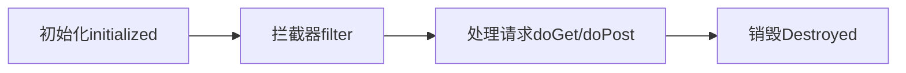
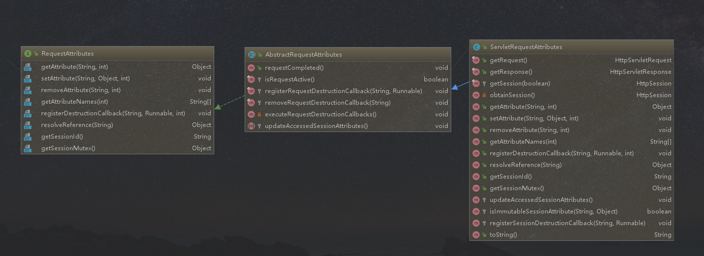
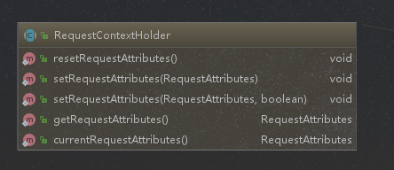

## 传统 Servlet 回顾

### 什么是Servlet？

Servlet 是一种基于 Java 技术的 Web 组件，用于生成`动态内容`，由容器管理。类似于其他 Java 技术组件，Servlet 是平台无关的 Java 类组成，并且由 Java Web 服务器加载执行。

### 什么是Servlet容器？

  Servlet 容器，有时候也称作为 Servlet 引擎，作为Web服务器或应用服务器的一部分。通过请求和响应对话，提供 Web 客户端与 Servlets 交互的能力。容器管理Servlets实例以及它们的生命周期。

### 历史

  1997年六月，Servlet 1.0 版本发行，最新版本 Servlet 4.0 处于研发状态。

### 核心接口

#### Servlet3.0之前

##### 服务组件

* javax.servlet.Servlet

* javax.servlet.Filter           

  > `Servlet 2.3出现的`

##### 上下文组件

* javax.servlet.ServletContext

  > 生命周期和应用的生命周期一致

* javax.servlet.http.HttpSession

  > 可以通过cookie或者url重写来进行跟踪。
  >
  > HTTP是无状态的，所以服务器要通过session/cookie来保存会话的状态
  >
  > 生命周期和会话的生命周期一致

* javax.servlet.http.HttpServletRequest

  > 生命周期：一次请求的开始->结束

* javax.servlet.http.HttpServletResponse

* javax.servlet.http.Cookie（客户端）

  > 短时间，小量的存储

##### 配置

* javax.servlet.ServletConfig
* javax.servlet.FilterConfig（since Servlet 2.3 ）

##### 输入输出

* javax.servlet.ServletInputStream

  > 1、上文文件的时候，要使用此接口获取上传的文件流
  >
  > 2、get/post请求的时候，参数放到requestBody里，要通过此接口来获取
  >
  > 3、请求体是二进制数据的时候

* javax.servlet.ServletOutputStream

##### 异常

* javax.servlet.ServletException

##### 事件（since Servlet 2.3 ）

###### 生命周期类型

* javax.servlet.ServletContextEvent
* javax.servlet.http.HttpSessionEvent
* java.servlet.ServletRequestEvent

###### 属性上下文类型

* javax.servlet.ServletContextAttributeEvent
* javax.servlet.http.HttpSessionBindingEvent
* javax.servlet.ServletRequestAttributeEvent

##### 监听器（since Servlet 2.3）

###### 生命周期类型

* javax.servlet.ServletContextListener

  > 实现这个接口接收通知的更改web应用程序的servlet上下文的一部分。接收通知事件,实现类必须在部署描述符中配置的web应用程序。

* javax.servlet.http.HttpSessionListener

  > 实现这个接口的更改通知活动会话在web应用程序的列表。接收通知事件,实现类必须在部署描述符中配置的web应用程序。

* javax.servlet.http.HttpSessionActivationListener

  > 对象绑定到一个会话可能听容器事件通知他们会议将钝化,会话将被激活。容器vm之间迁移会话或继续会话需要通知所有属性绑定到会话实现Http会话激活监听器。

* javax.servlet.ServletRequestListener

  > Servlet请求听众感兴趣的开发人员可以实现被通知的请求的范围在web组件。请求被定义为进入范围时进入第一个servlet或过滤器在每个web应用程序中,外出的范围当它退出最后一个servlet或链中第一个过滤器。

###### 属性上下文类型

* javax.servlet.ServletContextAttributeListener
* javax.servlet.http.HttpSessionAttributeListener
* javax.servlet.http.HttpSessionBindingListener
* javax.servlet.ServletRequestAttributeListener

#### Servlet3.0之后

是通过注解或API来代替之前的web.xml

##### 组件声明注解

* @javax.servlet.annotation.WebServlet

  > 此注解用于定义Web应用程序中的servlet组件。这个注解是在类上指定的，并包含关于声明的servlet的元数据。
  >
  > 带有@WebServlet类注解的类必须扩展javax.servlet.http.HttpServlet类。
  >
  > ```java
  > @WebServlet("/myServlet")
  > public class MyServlet extends HttpServlet {
  > }
  > ```
  >
  >

* @javax.servlet.annotation.WebFilter

  > 此注解用于定义Web应用程序中的筛选器。此注解是在类上指定的，并包含有关所声明的筛选器的元数据。如果没有，则为筛选器的默认名称。 指定的是完全限定的类名。必须指定注解的URL模式属性、ServLITNEX属性或值属性。
  >
  > ```java
  > @WebFilter(“/foo”)
  > public class MyFilter implements Filter {
  > public void doFilter(HttpServletRequest req, HttpServletResponse 
  > res) 
  > {
  > ...
  > }
  > }
  > ```
  >
  >

* @javax.servlet.annotation.WebListener

  > WebListener注解用于注解侦听器，以获取特定Web应用程序上下文上的各种操作的事件。带有@WebListener注解的类必须实现以下接口之一
  >
  > * javax.servlet.ServletContextListener
  > * javax.servlet.ServletContextAttributeListener
  > *  javax.servlet.ServletRequestListener
  > *  javax.servlet.ServletRequestAttributeListener
  > * javax.servlet.http.HttpSessionListener
  > * javax.servlet.http.HttpSessionAttributeListener
  > * javax.servlet.http.HttpSessionIdListener
  >
  > ```java
  > @WebListener
  > public class MyListener implements ServletContextListener{
  >  public void contextInitialized(ServletContextEvent sce) {
  >  ServletContext sc = sce.getServletContext();
  >  sc.addServlet("myServlet", "Sample servlet", 
  > "foo.bar.MyServlet", null, -1);
  >  sc.addServletMapping("myServlet", new String[] { 
  > "/urlpattern/*" });
  >  }
  > }
  > ```
  >
  >

* @javax.servlet.annotation.ServletSecurity

  > @ServletSecurity注解提供了一种替代机制，用于定义访问控制约束，相当于那些本来可以通过安全-con声明的约束。 可移植部署描述符中的straint元素或通过servlet注册接口的setServletSecurity方法进行编程。servlet容器必须支持使用@se 实现javax.servlet.Servlet接口的类(及其子类)上的rvletSecurity注解

  ```java
  @Inherited
  @Target(ElementType.TYPE)
  @Retention(RetentionPolicy.RUNTIME)
  @Documented
  public @interface ServletSecurity {
  
    
      enum EmptyRoleSemantic {
  
        
          PERMIT,
  
       
          DENY
      }
  
     
      enum TransportGuarantee {  
          NONE,
          CONFIDENTIAL
      }
  	/**
  	*默认约束适用于请求不是由特定方法的约束
  	*/
      HttpConstraint value() default @HttpConstraint;
  	/**
  	*Http方法约束对象数组安全约束将被应用
  	*/
      HttpMethodConstraint[] httpMethodConstraints() default {};
  }
  ```

* @javax.servlet.annotation.HttpMethodConstraint

  > @HttpMethodConstraint注解在@ServletSecurity注解中用于表示特定HTTP协议消息的安全约束。


* @javax.servlet.annotation.HttpConstraint

  > @HttpConstraint注解在@ServletSecurity中使用注解表示要应用于所有HTTP协议的安全性约束不会发生相应的@HttpMethodConstraint的方法在@ServletSecurity注解中。


##### 配置声明

* @javax.servlet.annotation.WebInitParam

  > 此注释用于指定必须传递给servlet或过滤器的任何init参数。它是WebServlet和WebFilter注释的一个属性

##### 上下文

* javax.servlet.AsyncContext

  > 异步上下文

##### 事件

* javax.servlet.AsyncEvent

##### 监听器

* javax.servlet.AsyncListener

##### Servlet 组件注册

* javax.servlet.ServletContext#addServlet()

* javax.servlet.ServletRegistration

##### Filter 组件注册

* javax.servlet.ServletContext#addFilter()

* javax.servlet.FilterRegistration

##### 监听器注册

* javax.servlet.ServletContext#addListener()

* javax.servlet.AsyncListener

##### 自动装配

###### 初始器

* javax.servlet.ServletContainerInitializer

  > ServletContainerInitializers（SCI）通过文件中的条目注册
  > META-INF/services/javax.servlet.ServletContainerInitializer，必须包含在包含SCI实现的JAR文件中。
  >
  > 基于SPI

###### 类型过滤

* @javax.servlet.annotation.HandlesTypes

  > 该注释用于声明一个数组的应用程序类传递给`javax.servlet.ServletContainerInitializer`。

生命周期


### 生命周期

#### Servlet 生命周期

```java
public interface Servlet {
    public void init(ServletConfig config) throws ServletException;
    public ServletConfig getServletConfig(); 
    public void service(ServletRequest req, ServletResponse res)
            throws ServletException, IOException;   
    public String getServletInfo();
    public void destroy();
}
```

`javax.servlet.http.HttpServlet#service(javax.servlet.http.HttpServletRequest, javax.servlet.http.HttpServletResponse)`

```java
 protected void service(HttpServletRequest req, HttpServletResponse resp)
        throws ServletException, IOException {

        String method = req.getMethod();

        if (method.equals(METHOD_GET)) {
            long lastModified = getLastModified(req);
            if (lastModified == -1) {
                // servlet doesn't support if-modified-since, no reason
                // to go through further expensive logic
                doGet(req, resp);
            } else {
                long ifModifiedSince;
                try {
                    ifModifiedSince = req.getDateHeader(HEADER_IFMODSINCE);
                } catch (IllegalArgumentException iae) {
                    // Invalid date header - proceed as if none was set
                    ifModifiedSince = -1;
                }
                if (ifModifiedSince < (lastModified / 1000 * 1000)) {     
                    maybeSetLastModified(resp, lastModified);
                    doGet(req, resp);
                } else {
                    resp.setStatus(HttpServletResponse.SC_NOT_MODIFIED);
                }
            }

        } else if (method.equals(METHOD_HEAD)) {
            long lastModified = getLastModified(req);
            maybeSetLastModified(resp, lastModified);
            doHead(req, resp);

        } else if (method.equals(METHOD_POST)) {
            doPost(req, resp);

        } else if (method.equals(METHOD_PUT)) {
            doPut(req, resp);

        } else if (method.equals(METHOD_DELETE)) {
            doDelete(req, resp);

        } else if (method.equals(METHOD_OPTIONS)) {
            doOptions(req,resp);

        } else if (method.equals(METHOD_TRACE)) {
            doTrace(req,resp);

        } else {
            String errMsg = lStrings.getString("http.method_not_implemented");
            Object[] errArgs = new Object[1];
            errArgs[0] = method;
            errMsg = MessageFormat.format(errMsg, errArgs);

            resp.sendError(HttpServletResponse.SC_NOT_IMPLEMENTED, errMsg);
        }
    }

```


##### 初始化

当容器启动或者第一次执行时，Servlet#init(ServletConfig)方法被执行，初始化当前Servlet 。

##### 处理请求

当HTTP 请求到达容器时，Servlet#service(ServletRequest,ServletResponse) 方法被执行，来处理请求。

##### 销毁

当容器关闭时，容器将会调用Servlet#destroy 方法被执行，销毁当前Servlet。

#### Filter 生命周期

##### 初始化

当容器启动时，Filter#init(FilterConfig)方法被执行，初始化当前Filter。

##### 处理请求

当HTTP 请求到达容器时，Filter#doFilter(ServletRequest,ServletResponse,FilterChain) 方法被执行，来拦截请求，在Servlet#service(ServletRequest,ServletResponse) 方法调用前执行。

##### 销毁

当容器关闭时，容器将会调用Filter#destroy 方法被执行，销毁当前Filter。

## Servlet on Spring Boot

### Servlet 组件扫描

#### @org.springframework.boot.web.servlet.ServletComponentScan

##### 指定包路径扫描

* String[] value() default {}

* String[] basePackages() default {}

##### 指定类扫描

* Class<?>[] basePackageClasses() default {}

```java
/**
 * Enables scanning for Servlet components ({@link WebFilter filters}, {@link WebServlet
 * servlets}, and {@link WebListener listeners}). Scanning is only performed when using an
 * embedded web server.
 * <p>
 * Typically, one of {@code value}, {@code basePackages}, or {@code basePackageClasses}
 * should be specified to control the packages to be scanned for components. In their
 * absence, scanning will be performed from the package of the class with the annotation.
 *
 * @author Andy Wilkinson
 * @since 1.3.0
 * @see WebServlet
 * @see WebFilter
 * @see WebListener
 */
@Target(ElementType.TYPE)
@Retention(RetentionPolicy.RUNTIME)
@Documented
@Import(ServletComponentScanRegistrar.class)
public @interface ServletComponentScan {
	@AliasFor("basePackages")
	String[] value() default {};
	@AliasFor("value")
	String[] basePackages() default {};

	Class<?>[] basePackageClasses() default {};

}
```

### 注解方式注册

#### Servlet 组件

##### 扩展 javax.servlet.Servlet

* javax.servlet.http.HttpServlet

* org.springframework.web.servlet.FrameworkServlet

##### 标记 @javax.servlet.annotation.WebServlet

```java
@SpringBootApplication
//设置servlet扫描类路径
@ServletComponentScan(basePackages = {"com.lch.spring.boot.lesson4.servlet"})
public class SpringBootLesson4Application {
    public static void main(String[] args) {
        new SpringApplicationBuilder(SpringBootLesson4Application.class).
                web(WebApplicationType.SERVLET).run(args);
    }
}
package com.lch.spring.boot.lesson4.servlet;

import javax.servlet.ServletException;
import javax.servlet.annotation.WebServlet;
import javax.servlet.http.HttpServlet;
import javax.servlet.http.HttpServletRequest;
import javax.servlet.http.HttpServletResponse;
import java.io.IOException;
import java.io.PrintWriter;

/**
 * @ClassName MyServlet
 * @Description
 * @Authod lichanghong
 * @Date 2018/8/20 15:08
 **/
@WebServlet(
        name = "myServlet",
        urlPatterns = {"/myServlet"},
        initParams = {//增加启动参数
                @WebInitParam(name = "myValue",value = "myValue")
        }
        )
public class MyServlet extends HttpServlet {
    private String value;
    //获取初始化参数
    @Override
    public void init(ServletConfig config){
        value = config.getInitParameter("myValue");
    }
    @Override
    protected void doGet(HttpServletRequest req, HttpServletResponse resp)
            throws ServletException, IOException {
        PrintWriter writer =resp.getWriter();
        writer.write("<html><body>Hello,World--InitParameter:"+value+"</body></html>");
    }
}


```


#### Filter 组件

##### 实现 javax.servlet.Filter

* org.springframework.web.filter.OncePerRequestFilter

  > 拦截只执行一次

##### 标记 @javax.servlet.annotation.WebFilter

```java
package javax.servlet.annotation;

import java.lang.annotation.Documented;
import java.lang.annotation.ElementType;
import java.lang.annotation.Retention;
import java.lang.annotation.RetentionPolicy;
import java.lang.annotation.Target;

import javax.servlet.DispatcherType;

/**
 * The annotation used to declare a Servlet {@link javax.servlet.Filter}. <br>
 * <br>
 *
 * This annotation will be processed by the container during deployment, the
 * Filter class in which it is found will be created as per the configuration
 * and applied to the URL patterns, {@link javax.servlet.Servlet}s and
 * {@link javax.servlet.DispatcherType}s.<br>
 * <br>
 *
 * If the name attribute is not defined, the fully qualified name of the class
 * is used.<br>
 * <br>
 *
 * At least one URL pattern MUST be declared in either the {@code value} or
 * {@code urlPattern} attribute of the annotation, but not both.<br>
 * <br>
 *
 * The {@code value} attribute is recommended for use when the URL pattern is
 * the only attribute being set, otherwise the {@code urlPattern} attribute
 * should be used.<br>
 * <br>
 *
 * The annotated class MUST implement {@link javax.servlet.Filter}.
 *
 * E.g.
 *
 * <code>@WebFilter("/path/*")</code><br>
 * <code>public class AnExampleFilter implements Filter { ... </code><br>
 *
 * @since Servlet 3.0 (Section 8.1.2)
 *
 */
@Target(ElementType.TYPE)
@Retention(RetentionPolicy.RUNTIME)
@Documented
public @interface WebFilter {

    /**
     * @return description of the Filter, if present
     */
    String description() default "";

    /**
     * @return display name of the Filter, if present
     */
    String displayName() default "";

    /**
     * @return array of initialization params for this Filter
     */
    WebInitParam[] initParams() default {};

    /**
     * @return name of the Filter, if present
     */
    String filterName() default "";

    /**
     * @return small icon for this Filter, if present
     */
    String smallIcon() default "";

    /**
     * @return the large icon for this Filter, if present
     */
    String largeIcon() default "";

    /**
     * @return array of Servlet names to which this Filter applies
     */
    String[] servletNames() default {};

    /**
     * A convenience method, to allow extremely simple annotation of a class.
     *
     * @return array of URL patterns
     * @see #urlPatterns()
     */
    String[] value() default {};

    /**
     * @return array of URL patterns to which this Filter applies
     */
    String[] urlPatterns() default {};

    /**
     * @return array of DispatcherTypes to which this filter applies
     */
    DispatcherType[] dispatcherTypes() default {DispatcherType.REQUEST};

    /**
     * @return asynchronous operation supported by this Filter
     */
    boolean asyncSupported() default false;
}

```


```java
package com.lch.spring.boot.lesson4.servlet;

import org.springframework.web.filter.OncePerRequestFilter;

import javax.servlet.FilterChain;
import javax.servlet.ServletContext;
import javax.servlet.ServletException;
import javax.servlet.annotation.WebFilter;
import javax.servlet.http.HttpServletRequest;
import javax.servlet.http.HttpServletResponse;
import java.io.IOException;

/**
 * @ClassName MyFilter
 * @Description 演示filter
 * @Authod lichanghong
 * @Date 2018/8/20 16:50
 **/
@WebFilter(servletNames = "myServlet",urlPatterns = "/myServlet")
public class MyFilter extends OncePerRequestFilter {
    @Override
    protected void doFilterInternal(HttpServletRequest request, HttpServletResponse response, FilterChain filterChain) throws ServletException, IOException {
        ServletContext context = request.getServletContext();
        //ServletContext servletContext = getServletContext();
        //servletContext 和 context是等价的
        context.log("myServlet被拦截了....");
        filterChain.doFilter(request, response);
    }
}
```

> servletNames和urlPatterns只用一个即可，效果是相同的

#### 监听器组件

##### 实现Listener接口

实现下列接口之一

* javax.servlet.ServletContextListener

  > 监听应用启动及销毁时的事件

* javax.servlet.http.HttpSessionListener

* javax.servlet.http.HttpSessionActivationListener

* javax.servlet.ServletRequestListener

  > 监听http请求事件信息

* javax.servlet.ServletContextAttributeListener

* javax.servlet.http.HttpSessionAttributeListener

* javax.servlet.http.HttpSessionBindingListener

* javax.servlet.ServletRequestAttributeListener

##### 标记 @javax.servlet.annotation.WebListener

```java
package com.lch.spring.boot.lesson4.servlet;

import javax.servlet.ServletContext;
import javax.servlet.ServletRequestEvent;
import javax.servlet.ServletRequestListener;
import javax.servlet.annotation.WebListener;

/**
 * @ClassName MyServletListener
 * @Description 事件监听
 * @Authod lichanghong
 * @Date 2018/8/20 17:06
 **/
@WebListener
public class MyServletListener implements ServletRequestListener {
    @Override
    public void requestDestroyed(ServletRequestEvent sre) {
        ServletContext context =sre.getServletContext();
        context.log("request    destroyed............");
    }

    @Override
    public void requestInitialized(ServletRequestEvent sre) {
        ServletContext context =sre.getServletContext();
        context.log("request    initialized............");
    }
}
```

```java
2018-08-20 17:09:14.222  INFO 17640 --- [nio-8080-exec-3] o.a.c.c.C.[Tomcat].[localhost].[/]       : request    initialized............
2018-08-20 17:09:14.225  INFO 17640 --- [nio-8080-exec-3] o.a.c.c.C.[Tomcat].[localhost].[/]       : myServlet     filterInternal....
2018-08-20 17:09:14.225  INFO 17640 --- [nio-8080-exec-3] o.a.c.c.C.[Tomcat].[localhost].[/]       : doGet().....
2018-08-20 17:09:14.225  INFO 17640 --- [nio-8080-exec-3] o.a.c.c.C.[Tomcat].[localhost].[/]       : request    destroyed............
```

==根据上面的日志可以得出request生命周期及执行顺序==




### Spring Boot API方式注册

#### Servlet 组件

##### 扩展 javax.servlet.Servlet

* javax.servlet.http.HttpServlet

* org.springframework.web.servlet.FrameworkServlet

##### 组装 Servlet

* Spring Boot 1.4.0 开始支持
  * org.springframework.boot.web.servlet.ServletRegistrationBean

* Spring Boot  1.4.0 之前
  * org.springframework.boot.context.embedded.ServletRegistrationBean

##### 暴露 Spring Bean

* @Bean

```java
   @Bean
    public static ServletRegistrationBean servletRegistrationBean(){
        ServletRegistrationBean servletRegistrationBean = new ServletRegistrationBean();
        //注册servlet
        servletRegistrationBean.setServlet(new MyServlet2());
        //设置映射信息
        servletRegistrationBean.addUrlMappings("/spring-boot/myServlet2");
        //设置启动参数
        servletRegistrationBean.addInitParameter("myName", "myValue");
        return servletRegistrationBean;
    }
public class MyServlet2 extends HttpServlet {
    private String value;
    //获取初始化参数
    @Override
    public void init(ServletConfig config) throws ServletException {
        super.init(config);
        value = config.getInitParameter("myName");
    }
    @Override
    protected void doGet(HttpServletRequest req, HttpServletResponse resp)
            throws ServletException, IOException {
        PrintWriter writer =resp.getWriter();
        ServletContext context = getServletContext();
        context.log("MyServlet2 doGet().....");
        writer.write("<html><body>Hello,World。MyServlet2--InitParameter:"+value+"</body></html>");
    }
}

```


#### Filter 组件

##### 实现 javax.servlet.Filter

* org.springframework.web.filter.OncePerRequestFilter

##### 组装 Filter

* Spring Boot 1.4.0 开始
  * org.springframework.boot.web.servlet.FilterRegistrationBean

* Spring Boot  1.4.0 之前
  * org.springframework.boot.context.embedded.FilterRegistrationBean

##### 暴露 Spring Bean

* @Bean

```java
/**
          * 声明一个filter的bean
          **/
    @Bean
    public static FilterRegistrationBean filterRegistrationBean(){
        FilterRegistrationBean filterRegistrationBean = new FilterRegistrationBean();
       //设置filter
        filterRegistrationBean.setFilter(new MyFilter2());
        //设置拦截路径
        filterRegistrationBean.addUrlPatterns("/spring-boot/*");
        //设置调度类型
        filterRegistrationBean.setDispatcherTypes(DispatcherType.REQUEST,DispatcherType.FORWARD,DispatcherType.INCLUDE);
        return filterRegistrationBean;
    }
```

```java
package com.lch.spring.boot.lesson4.spring.boot;


import org.springframework.web.context.request.RequestAttributes;
import org.springframework.web.context.request.RequestContextHolder;
import org.springframework.web.context.request.ServletRequestAttributes;
import org.springframework.web.filter.OncePerRequestFilter;

import javax.servlet.FilterChain;
import javax.servlet.ServletContext;
import javax.servlet.ServletException;
import javax.servlet.http.HttpServletRequest;
import javax.servlet.http.HttpServletResponse;
import java.io.IOException;

/**
 * @ClassName MyFilter2
 * @Description 演示filter
 * @Authod lichanghong
 * @Date 2018/8/20 16:50
 **/
public class MyFilter2 extends OncePerRequestFilter {
    @Override
    protected void doFilterInternal(HttpServletRequest request, HttpServletResponse response, FilterChain filterChain) throws ServletException, IOException {
        ServletContext context = request.getServletContext();
        //ServletContext servletContext = getServletContext()f;
        //servletContext 和 context是等价的
        String url = request.getRequestURI();
        context.log(url+"     filterInternal....");
        doSomething();
        filterChain.doFilter(request, response);
    }
     /**
         * 如果方法中没有传递HttpServletRequest对象，可以使用下面的方法来获取
         *
         **/
    public void doSomething(){
        //通过 RequestContextHolder 线程上下文来获取RequestAttributes
        RequestAttributes requestAttributes = RequestContextHolder.getRequestAttributes();
        //将RequestContextHolder强转为ServletRequestAttributes
        /*
        ServletRequestAttributes继承了AbstractRequestAttributes，
        AbstractRequestAttributes 实现了RequestAttributes接口
         */
        ServletRequestAttributes servletRequestAttributes = (ServletRequestAttributes) requestAttributes;
        /*
        *获取HttpServletRequest对象
         */
        HttpServletRequest request = servletRequestAttributes.getRequest();
        /*
            获取servletContext
         */
        ServletContext context = request.getServletContext();
        String requestUrl = request.getRequestURI();
        context.log("通过RequestContextHolder来过去上下文及HttpServletRequest");
    }
}

```






```java
/*
 * Licensed to the Apache Software Foundation (ASF) under one or more
 * contributor license agreements.  See the NOTICE file distributed with
 * this work for additional information regarding copyright ownership.
 * The ASF licenses this file to You under the Apache License, Version 2.0
 * (the "License"); you may not use this file except in compliance with
 * the License.  You may obtain a copy of the License at
 *
 *     http://www.apache.org/licenses/LICENSE-2.0
 *
 * Unless required by applicable law or agreed to in writing, software
 * distributed under the License is distributed on an "AS IS" BASIS,
 * WITHOUT WARRANTIES OR CONDITIONS OF ANY KIND, either express or implied.
 * See the License for the specific language governing permissions and
 * limitations under the License.
 */
package javax.servlet;

import java.io.BufferedReader;
import java.io.IOException;
import java.util.Enumeration;
import java.util.Locale;
import java.util.Map;

/**
 * Defines an object to provide client request information to a servlet. The
 * servlet container creates a <code>ServletRequest</code> object and passes it
 * as an argument to the servlet's <code>service</code> method.
 * <p>
 * A <code>ServletRequest</code> object provides data including parameter name
 * and values, attributes, and an input stream. Interfaces that extend
 * <code>ServletRequest</code> can provide additional protocol-specific data
 * (for example, HTTP data is provided by
 * {@link javax.servlet.http.HttpServletRequest}.
 *
 * @see javax.servlet.http.HttpServletRequest
 */
public interface ServletRequest {

    /**
     * Returns the value of the named attribute as an <code>Object</code>, or
     * <code>null</code> if no attribute of the given name exists.
     * <p>
     * Attributes can be set two ways. The servlet container may set attributes
     * to make available custom information about a request. For example, for
     * requests made using HTTPS, the attribute
     * <code>javax.servlet.request.X509Certificate</code> can be used to
     * retrieve information on the certificate of the client. Attributes can
     * also be set programmatically using {@link ServletRequest#setAttribute}.
     * This allows information to be embedded into a request before a
     * {@link RequestDispatcher} call.
     * <p>
     * Attribute names should follow the same conventions as package names.
     * Names beginning with <code>java.*</code> and <code>javax.*</code> are
     * reserved for use by the Servlet specification. Names beginning with
     * <code>sun.*</code>, <code>com.sun.*</code>, <code>oracle.*</code> and
     * <code>com.oracle.*</code>) are reserved for use by Oracle Corporation.
     *
     * @param name
     *            a <code>String</code> specifying the name of the attribute
     * @return an <code>Object</code> containing the value of the attribute, or
     *         <code>null</code> if the attribute does not exist
     */
    public Object getAttribute(String name);

    /**
     * Returns an <code>Enumeration</code> containing the names of the
     * attributes available to this request. This method returns an empty
     * <code>Enumeration</code> if the request has no attributes available to
     * it.
     *
     * @return an <code>Enumeration</code> of strings containing the names of the
     *         request's attributes
     */
    public Enumeration<String> getAttributeNames();

    /**
     * Returns the name of the character encoding used in the body of this
     * request. This method returns <code>null</code> if the request does not
     * specify a character encoding
     *
     * @return a <code>String</code> containing the name of the character
     *         encoding, or <code>null</code> if the request does not specify a
     *         character encoding
     */
    public String getCharacterEncoding();

    /**
     * Overrides the name of the character encoding used in the body of this
     * request. This method must be called prior to reading request parameters
     * or reading input using getReader().
     *
     * @param env
     *            a <code>String</code> containing the name of the character
     *            encoding.
     * @throws java.io.UnsupportedEncodingException
     *             if this is not a valid encoding
     */
    public void setCharacterEncoding(String env)
            throws java.io.UnsupportedEncodingException;

    /**
     * Returns the length, in bytes, of the request body and made available by
     * the input stream, or -1 if the length is not known. For HTTP servlets,
     * same as the value of the CGI variable CONTENT_LENGTH.
     *
     * @return an integer containing the length of the request body or -1 if the
     *         length is not known or is greater than {@link Integer#MAX_VALUE}
     */
    public int getContentLength();

    /**
     * Returns the length, in bytes, of the request body and made available by
     * the input stream, or -1 if the length is not known. For HTTP servlets,
     * same as the value of the CGI variable CONTENT_LENGTH.
     *
     * @return a long integer containing the length of the request body or -1 if
     *         the length is not known
     * @since Servlet 3.1
     */
    public long getContentLengthLong();

    /**
     * Returns the MIME type of the body of the request, or <code>null</code> if
     * the type is not known. For HTTP servlets, same as the value of the CGI
     * variable CONTENT_TYPE.
     *
     * @return a <code>String</code> containing the name of the MIME type of the
     *         request, or null if the type is not known
     */
    public String getContentType();

    /**
     * Retrieves the body of the request as binary data using a
     * {@link ServletInputStream}. Either this method or {@link #getReader} may
     * be called to read the body, not both.
     *
     * @return a {@link ServletInputStream} object containing the body of the
     *         request
     * @exception IllegalStateException
     *                if the {@link #getReader} method has already been called
     *                for this request
     * @exception IOException
     *                if an input or output exception occurred
     */
    public ServletInputStream getInputStream() throws IOException;

    /**
     * Returns the value of a request parameter as a <code>String</code>, or
     * <code>null</code> if the parameter does not exist. Request parameters are
     * extra information sent with the request. For HTTP servlets, parameters
     * are contained in the query string or posted form data.
     * <p>
     * You should only use this method when you are sure the parameter has only
     * one value. If the parameter might have more than one value, use
     * {@link #getParameterValues}.
     * <p>
     * If you use this method with a multivalued parameter, the value returned
     * is equal to the first value in the array returned by
     * <code>getParameterValues</code>.
     * <p>
     * If the parameter data was sent in the request body, such as occurs with
     * an HTTP POST request, then reading the body directly via
     * {@link #getInputStream} or {@link #getReader} can interfere with the
     * execution of this method.
     *
     * @param name
     *            a <code>String</code> specifying the name of the parameter
     * @return a <code>String</code> representing the single value of the
     *         parameter
     * @see #getParameterValues
     */
    public String getParameter(String name);

    /**
     * Returns an <code>Enumeration</code> of <code>String</code> objects
     * containing the names of the parameters contained in this request. If the
     * request has no parameters, the method returns an empty
     * <code>Enumeration</code>.
     *
     * @return an <code>Enumeration</code> of <code>String</code> objects, each
     *         <code>String</code> containing the name of a request parameter;
     *         or an empty <code>Enumeration</code> if the request has no
     *         parameters
     */
    public Enumeration<String> getParameterNames();

    /**
     * Returns an array of <code>String</code> objects containing all of the
     * values the given request parameter has, or <code>null</code> if the
     * parameter does not exist.
     * <p>
     * If the parameter has a single value, the array has a length of 1.
     *
     * @param name
     *            a <code>String</code> containing the name of the parameter
     *            whose value is requested
     * @return an array of <code>String</code> objects containing the parameter's
     *         values
     * @see #getParameter
     */
    public String[] getParameterValues(String name);

    /**
     * Returns a java.util.Map of the parameters of this request. Request
     * parameters are extra information sent with the request. For HTTP
     * servlets, parameters are contained in the query string or posted form
     * data.
     *
     * @return an immutable java.util.Map containing parameter names as keys and
     *         parameter values as map values. The keys in the parameter map are
     *         of type String. The values in the parameter map are of type
     *         String array.
     */
    public Map<String, String[]> getParameterMap();

    /**
     * Returns the name and version of the protocol the request uses in the form
     * <i>protocol/majorVersion.minorVersion</i>, for example, HTTP/1.1. For
     * HTTP servlets, the value returned is the same as the value of the CGI
     * variable <code>SERVER_PROTOCOL</code>.
     *
     * @return a <code>String</code> containing the protocol name and version
     *         number
     */
    public String getProtocol();

    /**
     * Returns the name of the scheme used to make this request, for example,
     * <code>http</code>, <code>https</code>, or <code>ftp</code>. Different
     * schemes have different rules for constructing URLs, as noted in RFC 1738.
     *
     * @return a <code>String</code> containing the name of the scheme used to
     *         make this request
     */
    public String getScheme();

    /**
     * Returns the host name of the server to which the request was sent. It is
     * the value of the part before ":" in the <code>Host</code> header value,
     * if any, or the resolved server name, or the server IP address.
     *
     * @return a <code>String</code> containing the name of the server
     */
    public String getServerName();

    /**
     * Returns the port number to which the request was sent. It is the value of
     * the part after ":" in the <code>Host</code> header value, if any, or the
     * server port where the client connection was accepted on.
     *
     * @return an integer specifying the port number
     */
    public int getServerPort();

    /**
     * Retrieves the body of the request as character data using a
     * <code>BufferedReader</code>. The reader translates the character data
     * according to the character encoding used on the body. Either this method
     * or {@link #getInputStream} may be called to read the body, not both.
     *
     * @return a <code>BufferedReader</code> containing the body of the request
     * @exception java.io.UnsupportedEncodingException
     *                if the character set encoding used is not supported and
     *                the text cannot be decoded
     * @exception IllegalStateException
     *                if {@link #getInputStream} method has been called on this
     *                request
     * @exception IOException
     *                if an input or output exception occurred
     * @see #getInputStream
     */
    public BufferedReader getReader() throws IOException;

    /**
     * Returns the Internet Protocol (IP) address of the client or last proxy
     * that sent the request. For HTTP servlets, same as the value of the CGI
     * variable <code>REMOTE_ADDR</code>.
     *
     * @return a <code>String</code> containing the IP address of the client
     *         that sent the request
     */
    public String getRemoteAddr();

    /**
     * Returns the fully qualified name of the client or the last proxy that
     * sent the request. If the engine cannot or chooses not to resolve the
     * hostname (to improve performance), this method returns the dotted-string
     * form of the IP address. For HTTP servlets, same as the value of the CGI
     * variable <code>REMOTE_HOST</code>.
     *
     * @return a <code>String</code> containing the fully qualified name of the
     *         client
     */
    public String getRemoteHost();

    /**
     * Stores an attribute in this request. Attributes are reset between
     * requests. This method is most often used in conjunction with
     * {@link RequestDispatcher}.
     * <p>
     * Attribute names should follow the same conventions as package names.
     * Names beginning with <code>java.*</code> and <code>javax.*</code> are
     * reserved for use by the Servlet specification. Names beginning with
     * <code>sun.*</code>, <code>com.sun.*</code>, <code>oracle.*</code> and
     * <code>com.oracle.*</code>) are reserved for use by Oracle Corporation.
     * <br>
     * If the object passed in is null, the effect is the same as calling
     * {@link #removeAttribute}. <br>
     * It is warned that when the request is dispatched from the servlet resides
     * in a different web application by <code>RequestDispatcher</code>, the
     * object set by this method may not be correctly retrieved in the caller
     * servlet.
     *
     * @param name
     *            a <code>String</code> specifying the name of the attribute
     * @param o
     *            the <code>Object</code> to be stored
     */
    public void setAttribute(String name, Object o);

    /**
     * Removes an attribute from this request. This method is not generally
     * needed as attributes only persist as long as the request is being
     * handled.
     * <p>
     * Attribute names should follow the same conventions as package names.
     * Names beginning with <code>java.*</code> and <code>javax.*</code> are
     * reserved for use by the Servlet specification. Names beginning with
     * <code>sun.*</code>, <code>com.sun.*</code>, <code>oracle.*</code> and
     * <code>com.oracle.*</code>) are reserved for use by Oracle Corporation.
     *
     * @param name
     *            a <code>String</code> specifying the name of the attribute to
     *            remove
     */
    public void removeAttribute(String name);

    /**
     * Returns the preferred <code>Locale</code> that the client will accept
     * content in, based on the Accept-Language header. If the client request
     * doesn't provide an Accept-Language header, this method returns the
     * default locale for the server.
     *
     * @return the preferred <code>Locale</code> for the client
     */
    public Locale getLocale();

    /**
     * Returns an <code>Enumeration</code> of <code>Locale</code> objects
     * indicating, in decreasing order starting with the preferred locale, the
     * locales that are acceptable to the client based on the Accept-Language
     * header. If the client request doesn't provide an Accept-Language header,
     * this method returns an <code>Enumeration</code> containing one
     * <code>Locale</code>, the default locale for the server.
     *
     * @return an <code>Enumeration</code> of preferred <code>Locale</code>
     *         objects for the client
     */
    public Enumeration<Locale> getLocales();

    /**
     * Returns a boolean indicating whether this request was made using a secure
     * channel, such as HTTPS.
     *
     * @return a boolean indicating if the request was made using a secure
     *         channel
     */
    public boolean isSecure();

    /**
     * Returns a {@link RequestDispatcher} object that acts as a wrapper for the
     * resource located at the given path. A <code>RequestDispatcher</code>
     * object can be used to forward a request to the resource or to include the
     * resource in a response. The resource can be dynamic or static.
     * <p>
     * The pathname specified may be relative, although it cannot extend outside
     * the current servlet context. If the path begins with a "/" it is
     * interpreted as relative to the current context root. This method returns
     * <code>null</code> if the servlet container cannot return a
     * <code>RequestDispatcher</code>.
     * <p>
     * The difference between this method and
     * {@link ServletContext#getRequestDispatcher} is that this method can take
     * a relative path.
     *
     * @param path
     *            a <code>String</code> specifying the pathname to the resource.
     *            If it is relative, it must be relative against the current
     *            servlet.
     * @return a <code>RequestDispatcher</code> object that acts as a wrapper for
     *         the resource at the specified path, or <code>null</code> if the
     *         servlet container cannot return a <code>RequestDispatcher</code>
     * @see RequestDispatcher
     * @see ServletContext#getRequestDispatcher
     */
    public RequestDispatcher getRequestDispatcher(String path);

    /**
     * @param path The virtual path to be converted to a real path
     * @return {@link ServletContext#getRealPath(String)}
     * @deprecated As of Version 2.1 of the Java Servlet API, use
     *             {@link ServletContext#getRealPath} instead.
     */
    @SuppressWarnings("dep-ann")
    // Spec API does not use @Deprecated
    public String getRealPath(String path);

    /**
     * Returns the Internet Protocol (IP) source port of the client or last
     * proxy that sent the request.
     *
     * @return an integer specifying the port number
     * @since Servlet 2.4
     */
    public int getRemotePort();

    /**
     * Returns the host name of the Internet Protocol (IP) interface on which
     * the request was received.
     *
     * @return a <code>String</code> containing the host name of the IP on which
     *         the request was received.
     * @since Servlet 2.4
     */
    public String getLocalName();

    /**
     * Returns the Internet Protocol (IP) address of the interface on which the
     * request was received.
     *
     * @return a <code>String</code> containing the IP address on which the
     *         request was received.
     * @since Servlet 2.4
     */
    public String getLocalAddr();

    /**
     * Returns the Internet Protocol (IP) port number of the interface on which
     * the request was received.
     *
     * @return an integer specifying the port number
     * @since Servlet 2.4
     */
    public int getLocalPort();

    /**
     * @return TODO
     * @since Servlet 3.0 TODO SERVLET3 - Add comments
     */
    public ServletContext getServletContext();

    /**
     * @return TODO
     * @throws IllegalStateException If async is not supported for this request
     * @since Servlet 3.0 TODO SERVLET3 - Add comments
     */
    public AsyncContext startAsync() throws IllegalStateException;

    /**
     * @param servletRequest    The ServletRequest with which to initialise the
     *                          asynchronous context
     * @param servletResponse   The ServletResponse with which to initialise the
     *                          asynchronous context
     * @return TODO
     * @throws IllegalStateException If async is not supported for this request
     * @since Servlet 3.0 TODO SERVLET3 - Add comments
     */
    public AsyncContext startAsync(ServletRequest servletRequest,
            ServletResponse servletResponse) throws IllegalStateException;

    /**
     * @return TODO
     * @since Servlet 3.0 TODO SERVLET3 - Add comments
     */
    public boolean isAsyncStarted();

    /**
     * @return TODO
     * @since Servlet 3.0 TODO SERVLET3 - Add comments
     */
    public boolean isAsyncSupported();

    /**
     * Get the current AsyncContext.
     *
     * @return The current AsyncContext
     *
     * @throws IllegalStateException if the request is not in asynchronous mode
     *         (i.e. @link #isAsyncStarted() is {@code false})
     *
     * @since Servlet 3.0
     */
    public AsyncContext getAsyncContext();

    /**
     * @return TODO
     * @since Servlet 3.0 TODO SERVLET3 - Add comments
     */
    public DispatcherType getDispatcherType();
}

```

```java
/*
 * Licensed to the Apache Software Foundation (ASF) under one or more
 * contributor license agreements.  See the NOTICE file distributed with
 * this work for additional information regarding copyright ownership.
 * The ASF licenses this file to You under the Apache License, Version 2.0
 * (the "License"); you may not use this file except in compliance with
 * the License.  You may obtain a copy of the License at
 *
 *     http://www.apache.org/licenses/LICENSE-2.0
 *
 * Unless required by applicable law or agreed to in writing, software
 * distributed under the License is distributed on an "AS IS" BASIS,
 * WITHOUT WARRANTIES OR CONDITIONS OF ANY KIND, either express or implied.
 * See the License for the specific language governing permissions and
 * limitations under the License.
 */

package javax.servlet.http;

import java.io.IOException;
import java.util.Collection;
import java.util.Enumeration;

import javax.servlet.ServletException;
import javax.servlet.ServletRequest;

/**
 * Extends the {@link javax.servlet.ServletRequest} interface to provide request
 * information for HTTP servlets.
 * <p>
 * The servlet container creates an <code>HttpServletRequest</code> object and
 * passes it as an argument to the servlet's service methods
 * (<code>doGet</code>, <code>doPost</code>, etc).
 */
public interface HttpServletRequest extends ServletRequest {

    /**
     * String identifier for Basic authentication. Value "BASIC"
     */
    public static final String BASIC_AUTH = "BASIC";
    /**
     * String identifier for Form authentication. Value "FORM"
     */
    public static final String FORM_AUTH = "FORM";
    /**
     * String identifier for Client Certificate authentication. Value
     * "CLIENT_CERT"
     */
    public static final String CLIENT_CERT_AUTH = "CLIENT_CERT";
    /**
     * String identifier for Digest authentication. Value "DIGEST"
     */
    public static final String DIGEST_AUTH = "DIGEST";

    /**
     * Returns the name of the authentication scheme used to protect the
     * servlet. All servlet containers support basic, form and client
     * certificate authentication, and may additionally support digest
     * authentication. If the servlet is not authenticated <code>null</code> is
     * returned.
     * <p>
     * Same as the value of the CGI variable AUTH_TYPE.
     *
     * @return one of the static members BASIC_AUTH, FORM_AUTH, CLIENT_CERT_AUTH,
     *         DIGEST_AUTH (suitable for == comparison) or the
     *         container-specific string indicating the authentication scheme,
     *         or <code>null</code> if the request was not authenticated.
     */
    public String getAuthType();

    /**
     * Returns an array containing all of the <code>Cookie</code> objects the
     * client sent with this request. This method returns <code>null</code> if
     * no cookies were sent.
     *
     * @return an array of all the <code>Cookies</code> included with this
     *         request, or <code>null</code> if the request has no cookies
     */
    public Cookie[] getCookies();

    /**
     * Returns the value of the specified request header as a <code>long</code>
     * value that represents a <code>Date</code> object. Use this method with
     * headers that contain dates, such as <code>If-Modified-Since</code>.
     * <p>
     * The date is returned as the number of milliseconds since January 1, 1970
     * GMT. The header name is case insensitive.
     * <p>
     * If the request did not have a header of the specified name, this method
     * returns -1. If the header can't be converted to a date, the method throws
     * an <code>IllegalArgumentException</code>.
     *
     * @param name
     *            a <code>String</code> specifying the name of the header
     * @return a <code>long</code> value representing the date specified in the
     *         header expressed as the number of milliseconds since January 1,
     *         1970 GMT, or -1 if the named header was not included with the
     *         request
     * @exception IllegalArgumentException
     *                If the header value can't be converted to a date
     */
    public long getDateHeader(String name);

    /**
     * Returns the value of the specified request header as a
     * <code>String</code>. If the request did not include a header of the
     * specified name, this method returns <code>null</code>. If there are
     * multiple headers with the same name, this method returns the first head
     * in the request. The header name is case insensitive. You can use this
     * method with any request header.
     *
     * @param name
     *            a <code>String</code> specifying the header name
     * @return a <code>String</code> containing the value of the requested
     *         header, or <code>null</code> if the request does not have a
     *         header of that name
     */
    public String getHeader(String name);

    /**
     * Returns all the values of the specified request header as an
     * <code>Enumeration</code> of <code>String</code> objects.
     * <p>
     * Some headers, such as <code>Accept-Language</code> can be sent by clients
     * as several headers each with a different value rather than sending the
     * header as a comma separated list.
     * <p>
     * If the request did not include any headers of the specified name, this
     * method returns an empty <code>Enumeration</code>. The header name is case
     * insensitive. You can use this method with any request header.
     *
     * @param name
     *            a <code>String</code> specifying the header name
     * @return an <code>Enumeration</code> containing the values of the requested
     *         header. If the request does not have any headers of that name
     *         return an empty enumeration. If the container does not allow
     *         access to header information, return null
     */
    public Enumeration<String> getHeaders(String name);

    /**
     * Returns an enumeration of all the header names this request contains. If
     * the request has no headers, this method returns an empty enumeration.
     * <p>
     * Some servlet containers do not allow servlets to access headers using
     * this method, in which case this method returns <code>null</code>
     *
     * @return an enumeration of all the header names sent with this request; if
     *         the request has no headers, an empty enumeration; if the servlet
     *         container does not allow servlets to use this method,
     *         <code>null</code>
     */
    public Enumeration<String> getHeaderNames();

    /**
     * Returns the value of the specified request header as an <code>int</code>.
     * If the request does not have a header of the specified name, this method
     * returns -1. If the header cannot be converted to an integer, this method
     * throws a <code>NumberFormatException</code>.
     * <p>
     * The header name is case insensitive.
     *
     * @param name
     *            a <code>String</code> specifying the name of a request header
     * @return an integer expressing the value of the request header or -1 if the
     *         request doesn't have a header of this name
     * @exception NumberFormatException
     *                If the header value can't be converted to an
     *                <code>int</code>
     */
    public int getIntHeader(String name);

    /**
     * Returns the name of the HTTP method with which this request was made, for
     * example, GET, POST, or PUT. Same as the value of the CGI variable
     * REQUEST_METHOD.
     *
     * @return a <code>String</code> specifying the name of the method with
     *         which this request was made
     */
    public String getMethod();

    /**
     * Returns any extra path information associated with the URL the client
     * sent when it made this request. The extra path information follows the
     * servlet path but precedes the query string and will start with a "/"
     * character.
     * <p>
     * This method returns <code>null</code> if there was no extra path
     * information.
     * <p>
     * Same as the value of the CGI variable PATH_INFO.
     *
     * @return a <code>String</code>, decoded by the web container, specifying
     *         extra path information that comes after the servlet path but
     *         before the query string in the request URL; or <code>null</code>
     *         if the URL does not have any extra path information
     */
    public String getPathInfo();

    /**
     * Returns any extra path information after the servlet name but before the
     * query string, and translates it to a real path. Same as the value of the
     * CGI variable PATH_TRANSLATED.
     * <p>
     * If the URL does not have any extra path information, this method returns
     * <code>null</code> or the servlet container cannot translate the virtual
     * path to a real path for any reason (such as when the web application is
     * executed from an archive). The web container does not decode this string.
     *
     * @return a <code>String</code> specifying the real path, or
     *         <code>null</code> if the URL does not have any extra path
     *         information
     */
    public String getPathTranslated();

    /**
     * Returns the portion of the request URI that indicates the context of the
     * request. The context path always comes first in a request URI. The path
     * starts with a "/" character but does not end with a "/" character. For
     * servlets in the default (root) context, this method returns "". The
     * container does not decode this string.
     *
     * @return a <code>String</code> specifying the portion of the request URI
     *         that indicates the context of the request
     */
    public String getContextPath();

    /**
     * Returns the query string that is contained in the request URL after the
     * path. This method returns <code>null</code> if the URL does not have a
     * query string. Same as the value of the CGI variable QUERY_STRING.
     *
     * @return a <code>String</code> containing the query string or
     *         <code>null</code> if the URL contains no query string. The value
     *         is not decoded by the container.
     */
    public String getQueryString();

    /**
     * Returns the login of the user making this request, if the user has been
     * authenticated, or <code>null</code> if the user has not been
     * authenticated. Whether the user name is sent with each subsequent request
     * depends on the browser and type of authentication. Same as the value of
     * the CGI variable REMOTE_USER.
     *
     * @return a <code>String</code> specifying the login of the user making
     *         this request, or <code>null</code> if the user login is not known
     */
    public String getRemoteUser();

    /**
     * Returns a boolean indicating whether the authenticated user is included
     * in the specified logical "role". Roles and role membership can be defined
     * using deployment descriptors. If the user has not been authenticated, the
     * method returns <code>false</code>.
     *
     * @param role
     *            a <code>String</code> specifying the name of the role
     * @return a <code>boolean</code> indicating whether the user making this
     *         request belongs to a given role; <code>false</code> if the user
     *         has not been authenticated
     */
    public boolean isUserInRole(String role);

    /**
     * Returns a <code>java.security.Principal</code> object containing the name
     * of the current authenticated user. If the user has not been
     * authenticated, the method returns <code>null</code>.
     *
     * @return a <code>java.security.Principal</code> containing the name of the
     *         user making this request; <code>null</code> if the user has not
     *         been authenticated
     */
    public java.security.Principal getUserPrincipal();

    /**
     * Returns the session ID specified by the client. This may not be the same
     * as the ID of the current valid session for this request. If the client
     * did not specify a session ID, this method returns <code>null</code>.
     *
     * @return a <code>String</code> specifying the session ID, or
     *         <code>null</code> if the request did not specify a session ID
     * @see #isRequestedSessionIdValid
     */
    public String getRequestedSessionId();

    /**
     * Returns the part of this request's URL from the protocol name up to the
     * query string in the first line of the HTTP request. The web container
     * does not decode this String. For example:
     * <table summary="Examples of Returned Values">
     * <tr align=left>
     * <th>First line of HTTP request</th>
     * <th>Returned Value</th>
     * <tr>
     * <td>POST /some/path.html HTTP/1.1
     * <td>
     * <td>/some/path.html
     * <tr>
     * <td>GET http://foo.bar/a.html HTTP/1.0
     * <td>
     * <td>/a.html
     * <tr>
     * <td>HEAD /xyz?a=b HTTP/1.1
     * <td>
     * <td>/xyz
     * </table>
     * <p>
     * To reconstruct an URL with a scheme and host, use
     * {@link #getRequestURL}.
     *
     * @return a <code>String</code> containing the part of the URL from the
     *         protocol name up to the query string
     * @see #getRequestURL
     */
    public String getRequestURI();

    /**
     * Reconstructs the URL the client used to make the request. The returned
     * URL contains a protocol, server name, port number, and server path, but
     * it does not include query string parameters.
     * <p>
     * Because this method returns a <code>StringBuffer</code>, not a string,
     * you can modify the URL easily, for example, to append query parameters.
     * <p>
     * This method is useful for creating redirect messages and for reporting
     * errors.
     *
     * @return a <code>StringBuffer</code> object containing the reconstructed
     *         URL
     */
    public StringBuffer getRequestURL();

    /**
     * Returns the part of this request's URL that calls the servlet. This path
     * starts with a "/" character and includes either the servlet name or a
     * path to the servlet, but does not include any extra path information or a
     * query string. Same as the value of the CGI variable SCRIPT_NAME.
     * <p>
     * This method will return an empty string ("") if the servlet used to
     * process this request was matched using the "/*" pattern.
     *
     * @return a <code>String</code> containing the name or path of the servlet
     *         being called, as specified in the request URL, decoded, or an
     *         empty string if the servlet used to process the request is
     *         matched using the "/*" pattern.
     */
    public String getServletPath();

    /**
     * Returns the current <code>HttpSession</code> associated with this request
     * or, if there is no current session and <code>create</code> is true,
     * returns a new session.
     * <p>
     * If <code>create</code> is <code>false</code> and the request has no valid
     * <code>HttpSession</code>, this method returns <code>null</code>.
     * <p>
     * To make sure the session is properly maintained, you must call this
     * method before the response is committed. If the container is using
     * cookies to maintain session integrity and is asked to create a new
     * session when the response is committed, an IllegalStateException is
     * thrown.
     *
     * @param create
     *            <code>true</code> to create a new session for this request if
     *            necessary; <code>false</code> to return <code>null</code> if
     *            there's no current session
     * @return the <code>HttpSession</code> associated with this request or
     *         <code>null</code> if <code>create</code> is <code>false</code>
     *         and the request has no valid session
     * @see #getSession()
     */
    public HttpSession getSession(boolean create);

    /**
     * Returns the current session associated with this request, or if the
     * request does not have a session, creates one.
     *
     * @return the <code>HttpSession</code> associated with this request
     * @see #getSession(boolean)
     */
    public HttpSession getSession();

    /**
     * Changes the session ID of the session associated with this request. This
     * method does not create a new session object it only changes the ID of the
     * current session.
     *
     * @return the new session ID allocated to the session
     * @see HttpSessionIdListener
     * @since Servlet 3.1
     */
    public String changeSessionId();

    /**
     * Checks whether the requested session ID is still valid.
     *
     * @return <code>true</code> if this request has an id for a valid session
     *         in the current session context; <code>false</code> otherwise
     * @see #getRequestedSessionId
     * @see #getSession
     */
    public boolean isRequestedSessionIdValid();

    /**
     * Checks whether the requested session ID came in as a cookie.
     *
     * @return <code>true</code> if the session ID came in as a cookie;
     *         otherwise, <code>false</code>
     * @see #getSession
     */
    public boolean isRequestedSessionIdFromCookie();

    /**
     * Checks whether the requested session ID came in as part of the request
     * URL.
     *
     * @return <code>true</code> if the session ID came in as part of a URL;
     *         otherwise, <code>false</code>
     * @see #getSession
     */
    public boolean isRequestedSessionIdFromURL();

    /**
     * @return {@link #isRequestedSessionIdFromURL()}
     * @deprecated As of Version 2.1 of the Java Servlet API, use
     *             {@link #isRequestedSessionIdFromURL} instead.
     */
    @SuppressWarnings("dep-ann")
    // Spec API does not use @Deprecated
    public boolean isRequestedSessionIdFromUrl();

    /**
     * Triggers the same authentication process as would be triggered if the
     * request is for a resource that is protected by a security constraint.
     *
     * @param response  The response to use to return any authentication
     *                  challenge
     * @return <code>true</code> if the user is successfully authenticated and
     *         <code>false</code> if not
     *
     * @throws IOException if the authentication process attempted to read from
     *         the request or write to the response and an I/O error occurred
     * @throws IllegalStateException if the authentication process attempted to
     *         write to the response after it had been committed
     * @throws ServletException if the authentication failed and the caller is
     *         expected to handle the failure
     * @since Servlet 3.0
     */
    public boolean authenticate(HttpServletResponse response)
            throws IOException, ServletException;

    /**
     * Authenticate the provided user name and password and then associated the
     * authenticated user with the request.
     *
     * @param username  The user name to authenticate
     * @param password  The password to use to authenticate the user
     *
     * @throws ServletException
     *             If any of {@link #getRemoteUser()},
     *             {@link #getUserPrincipal()} or {@link #getAuthType()} are
     *             non-null, if the configured authenticator does not support
     *             user name and password authentication or if the
     *             authentication fails
     * @since Servlet 3.0
     */
    public void login(String username, String password) throws ServletException;

    /**
     * Removes any authenticated user from the request.
     *
     * @throws ServletException
     *             If the logout fails
     * @since Servlet 3.0
     */
    public void logout() throws ServletException;

    /**
     * Return a collection of all uploaded Parts.
     *
     * @return A collection of all uploaded Parts.
     * @throws IOException
     *             if an I/O error occurs
     * @throws IllegalStateException
     *             if size limits are exceeded or no multipart configuration is
     *             provided
     * @throws ServletException
     *             if the request is not multipart/form-data
     * @since Servlet 3.0
     */
    public Collection<Part> getParts() throws IOException,
            ServletException;

    /**
     * Gets the named Part or null if the Part does not exist. Triggers upload
     * of all Parts.
     *
     * @param name The name of the Part to obtain
     *
     * @return The named Part or null if the Part does not exist
     * @throws IOException
     *             if an I/O error occurs
     * @throws IllegalStateException
     *             if size limits are exceeded
     * @throws ServletException
     *             if the request is not multipart/form-data
     * @since Servlet 3.0
     */
    public Part getPart(String name) throws IOException,
            ServletException;

    /**
     * Start the HTTP upgrade process and pass the connection to the provided
     * protocol handler once the current request/response pair has completed
     * processing. Calling this method sets the response status to {@link
     * HttpServletResponse#SC_SWITCHING_PROTOCOLS} and flushes the response.
     * Protocol specific headers must have already been set before this method
     * is called.
     *
     * @param <T>                     The type of the upgrade handler
     * @param httpUpgradeHandlerClass The class that implements the upgrade
     *                                handler
     *
     * @return A newly created instance of the specified upgrade handler type
     *
     * @throws IOException
     *             if an I/O error occurred during the upgrade
     * @throws ServletException
     *             if the given httpUpgradeHandlerClass fails to be instantiated
     * @since Servlet 3.1
     */
    public <T extends HttpUpgradeHandler> T upgrade(
            Class<T> httpUpgradeHandlerClass) throws java.io.IOException, ServletException;
}

```


#### 监听器组件

##### 实现 Listener

##### 组装 Listener

* Spring Boot 1.4.0 开始
  * org.springframework.boot.web.servlet.ServletListenerRegistrationBean

* Spring Boot  1.4.0 之前
  * org.springframework.boot.context.embedded.ServletListenerRegistrationBean

##### 暴露 Spring Bean

* @Bean

```java
  /**
         * 声明一个事件监听器的bean
         * @param
         * @return
         * @date        2018/8/21 11:21
         **/
     @Bean
    public static ServletListenerRegistrationBean servletListenerRegistrationBean(){
        ServletListenerRegistrationBean servletListenerRegistrationBean = new ServletListenerRegistrationBean();
            //设置事件监听
            servletListenerRegistrationBean.setListener(new MyServletListener2());
        return servletListenerRegistrationBean;
    }
```

```java
package com.lch.spring.boot.lesson4.spring.boot;

import javax.servlet.ServletContext;
import javax.servlet.ServletRequestEvent;
import javax.servlet.ServletRequestListener;
import javax.servlet.annotation.WebListener;

/**
 * @ClassName MyServletListener2
 * @Description 事件监听
 * @Authod lichanghong
 * @Date 2018/8/20 17:06
 **/
public class MyServletListener2 implements ServletRequestListener {
    @Override
    public void requestDestroyed(ServletRequestEvent sre) {
        ServletContext context =sre.getServletContext();
        context.log("MyServletListener2 request    destroyed............");
    }

    @Override
    public void requestInitialized(ServletRequestEvent sre) {
        ServletContext context =sre.getServletContext();
        context.log("MyServletListener2 request    initialized............");
    }
}

```

日志输出

```java
2018-08-21 11:24:16.816  INFO 16348 --- [nio-9090-exec-2] o.a.c.c.C.[Tomcat].[localhost].[/]       : MyServletListener2 request    initialized............
2018-08-21 11:24:16.816  INFO 16348 --- [nio-9090-exec-2] o.a.c.c.C.[Tomcat].[localhost].[/]       : request    initialized............
2018-08-21 11:24:16.819  INFO 16348 --- [nio-9090-exec-2] o.a.c.c.C.[Tomcat].[localhost].[/]       : /spring-boot/myServlet2     filterInternal....
2018-08-21 11:24:16.819  INFO 16348 --- [nio-9090-exec-2] o.a.c.c.C.[Tomcat].[localhost].[/]       : 通过RequestContextHolder来过去上下文及HttpServletRequest
2018-08-21 11:24:16.819  INFO 16348 --- [nio-9090-exec-2] o.a.c.c.C.[Tomcat].[localhost].[/]       : /spring-boot/myServlet2 doGet().....
2018-08-21 11:24:16.820  INFO 16348 --- [nio-9090-exec-2] o.a.c.c.C.[Tomcat].[localhost].[/]       : request    destroyed............
2018-08-21 11:24:16.820  INFO 16348 --- [nio-9090-exec-2] o.a.c.c.C.[Tomcat].[localhost].[/]       : MyServletListener2 request    destroyed............
2018-08-21 11:24:16.842  INFO 16348 --- [nio-9090-exec-4] o.a.c.c.C.[Tomcat].[localhost].[/]       : MyServletListener2 request    initialized............
2018-08-21 11:24:16.842  INFO 16348 --- [nio-9090-exec-4] o.a.c.c.C.[Tomcat].[localhost].[/]       : request    initialized............
2018-08-21 11:24:16.844  INFO 16348 --- [nio-9090-exec-4] o.a.c.c.C.[Tomcat].[localhost].[/]       : request    destroyed............
2018-08-21 11:24:16.845  INFO 16348 --- [nio-9090-exec-4] o.a.c.c.C.[Tomcat].[localhost].[/]       : MyServletListener2 request    destroyed............

```


#### 激活

##### 激活 传统Servlet Web部署

* Spring Boot 1.4.0 开始
  * org.springframework.boot.web.support.SpringBootServletInitializer

##### 组装 org.springframework.boot.builder.SpringApplicationBuilder

##### 配置JSP视图

* org.springframework.boot.autoconfigure.web.WebMvcProperties
  * spring.mvc.view.prefix
  * spring.mvc.view.suffix

```java
org.springframework.boot.autoconfigure.web.servlet.JspTemplateAvailabilityProvider
//判断jsp是否存在，默认会去src/main/webapp目录下查找
	public boolean isTemplateAvailable(String view, Environment environment,
			ClassLoader classLoader, ResourceLoader resourceLoader) {
		if (ClassUtils.isPresent("org.apache.jasper.compiler.JspConfig", classLoader)) {
			String resourceName = getResourceName(view, environment);
			if (resourceLoader.getResource(resourceName).exists()) {
				return true;
			}
			return new File("src/main/webapp", resourceName).exists();
		}
		return false;
	}
```

```properties
#设置jsp的前缀
spring.mvc.view.prefix = /WEB-INF/jsp/
#设置jsp的后缀
spring.mvc.view.suffix = .jsp
```

