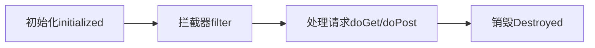

## 传统 Servlet 回顾

### 什么是Servlet？

Servlet 是一种基于 Java 技术的 Web 组件，用于生成`动态内容`，由容器管理。类似于其他 Java 技术组件，Servlet 是平台无关的 Java 类组成，并且由 Java Web 服务器加载执行。

### 什么是Servlet容器？

  Servlet 容器，有时候也称作为 Servlet 引擎，作为Web服务器或应用服务器的一部分。通过请求和响应对话，提供 Web 客户端与 Servlets 交互的能力。容器管理Servlets实例以及它们的生命周期。

### 历史

  1997年六月，Servlet 1.0 版本发行，最新版本 Servlet 4.0 处于研发状态。

### 核心接口

#### Servlet3.0之前

##### 服务组件

* javax.servlet.Servlet

* javax.servlet.Filter           

  > `Servlet 2.3出现的`

##### 上下文组件

* javax.servlet.ServletContext

  > 生命周期和应用的生命周期一致

* javax.servlet.http.HttpSession

  > 可以通过cookie或者url重写来进行跟踪。
  >
  > HTTP是无状态的，所以服务器要通过session/cookie来保存会话的状态
  >
  > 生命周期和会话的生命周期一致

* javax.servlet.http.HttpServletRequest

  > 生命周期：一次请求的开始->结束

* javax.servlet.http.HttpServletResponse

* javax.servlet.http.Cookie（客户端）

  > 短时间，小量的存储

##### 配置

* javax.servlet.ServletConfig
* javax.servlet.FilterConfig（since Servlet 2.3 ）

##### 输入输出

* javax.servlet.ServletInputStream

  > 1、上文文件的时候，要使用此接口获取上传的文件流
  >
  > 2、get/post请求的时候，参数放到requestBody里，要通过此接口来获取
  >
  > 3、请求体是二进制数据的时候

* javax.servlet.ServletOutputStream

##### 异常

* javax.servlet.ServletException

##### 事件（since Servlet 2.3 ）

###### 生命周期类型

* javax.servlet.ServletContextEvent
* javax.servlet.http.HttpSessionEvent
* java.servlet.ServletRequestEvent

###### 属性上下文类型

* javax.servlet.ServletContextAttributeEvent
* javax.servlet.http.HttpSessionBindingEvent
* javax.servlet.ServletRequestAttributeEvent

##### 监听器（since Servlet 2.3）

###### 生命周期类型

* javax.servlet.ServletContextListener

  > 实现这个接口接收通知的更改web应用程序的servlet上下文的一部分。接收通知事件,实现类必须在部署描述符中配置的web应用程序。

* javax.servlet.http.HttpSessionListener

  > 实现这个接口的更改通知活动会话在web应用程序的列表。接收通知事件,实现类必须在部署描述符中配置的web应用程序。

* javax.servlet.http.HttpSessionActivationListener

  > 对象绑定到一个会话可能听容器事件通知他们会议将钝化,会话将被激活。容器vm之间迁移会话或继续会话需要通知所有属性绑定到会话实现Http会话激活监听器。

* javax.servlet.ServletRequestListener

  > Servlet请求听众感兴趣的开发人员可以实现被通知的请求的范围在web组件。请求被定义为进入范围时进入第一个servlet或过滤器在每个web应用程序中,外出的范围当它退出最后一个servlet或链中第一个过滤器。

###### 属性上下文类型

* javax.servlet.ServletContextAttributeListener
* javax.servlet.http.HttpSessionAttributeListener
* javax.servlet.http.HttpSessionBindingListener
* javax.servlet.ServletRequestAttributeListener

#### Servlet3.0之后

是通过注解或API来代替之前的web.xml

##### 组件声明注解

* @javax.servlet.annotation.WebServlet

  > 此注解用于定义Web应用程序中的servlet组件。这个注解是在类上指定的，并包含关于声明的servlet的元数据。
  >
  > 带有@WebServlet类注解的类必须扩展javax.servlet.http.HttpServlet类。
  >
  > ```java
  > @WebServlet("/myServlet")
  > public class MyServlet extends HttpServlet {
  > }
  > ```
  >
  >

* @javax.servlet.annotation.WebFilter

  > 此注解用于定义Web应用程序中的筛选器。此注解是在类上指定的，并包含有关所声明的筛选器的元数据。如果没有，则为筛选器的默认名称。 指定的是完全限定的类名。必须指定注解的URL模式属性、ServLITNEX属性或值属性。
  >
  > ```java
  > @WebFilter(“/foo”)
  > public class MyFilter implements Filter {
  > public void doFilter(HttpServletRequest req, HttpServletResponse 
  > res) 
  > {
  > ...
  > }
  > }
  > ```
  >
  >

* @javax.servlet.annotation.WebListener

  > WebListener注解用于注解侦听器，以获取特定Web应用程序上下文上的各种操作的事件。带有@WebListener注解的类必须实现以下接口之一
  >
  > * javax.servlet.ServletContextListener
  > * javax.servlet.ServletContextAttributeListener
  > *  javax.servlet.ServletRequestListener
  > *  javax.servlet.ServletRequestAttributeListener
  > * javax.servlet.http.HttpSessionListener
  > * javax.servlet.http.HttpSessionAttributeListener
  > * javax.servlet.http.HttpSessionIdListener
  >
  > ```java
  > @WebListener
  > public class MyListener implements ServletContextListener{
  >  public void contextInitialized(ServletContextEvent sce) {
  >  ServletContext sc = sce.getServletContext();
  >  sc.addServlet("myServlet", "Sample servlet", 
  > "foo.bar.MyServlet", null, -1);
  >  sc.addServletMapping("myServlet", new String[] { 
  > "/urlpattern/*" });
  >  }
  > }
  > ```
  >
  >

* @javax.servlet.annotation.ServletSecurity

  > @ServletSecurity注解提供了一种替代机制，用于定义访问控制约束，相当于那些本来可以通过安全-con声明的约束。 可移植部署描述符中的straint元素或通过servlet注册接口的setServletSecurity方法进行编程。servlet容器必须支持使用@se 实现javax.servlet.Servlet接口的类(及其子类)上的rvletSecurity注解

  ```java
  @Inherited
  @Target(ElementType.TYPE)
  @Retention(RetentionPolicy.RUNTIME)
  @Documented
  public @interface ServletSecurity {
  
    
      enum EmptyRoleSemantic {
  
        
          PERMIT,
  
       
          DENY
      }
  
     
      enum TransportGuarantee {  
          NONE,
          CONFIDENTIAL
      }
  	/**
  	*默认约束适用于请求不是由特定方法的约束
  	*/
      HttpConstraint value() default @HttpConstraint;
  	/**
  	*Http方法约束对象数组安全约束将被应用
  	*/
      HttpMethodConstraint[] httpMethodConstraints() default {};
  }
  ```

* @javax.servlet.annotation.HttpMethodConstraint

  > @HttpMethodConstraint注解在@ServletSecurity注解中用于表示特定HTTP协议消息的安全约束。


* @javax.servlet.annotation.HttpConstraint

  > @HttpConstraint注解在@ServletSecurity中使用注解表示要应用于所有HTTP协议的安全性约束不会发生相应的@HttpMethodConstraint的方法在@ServletSecurity注解中。


##### 配置声明

* @javax.servlet.annotation.WebInitParam

  > 此注释用于指定必须传递给servlet或过滤器的任何init参数。它是WebServlet和WebFilter注释的一个属性

##### 上下文

* javax.servlet.AsyncContext

  > 异步上下文

##### 事件

* javax.servlet.AsyncEvent

##### 监听器

* javax.servlet.AsyncListener

##### Servlet 组件注册

* javax.servlet.ServletContext#addServlet()

* javax.servlet.ServletRegistration

##### Filter 组件注册

* javax.servlet.ServletContext#addFilter()

* javax.servlet.FilterRegistration

##### 监听器注册

* javax.servlet.ServletContext#addListener()

* javax.servlet.AsyncListener

##### 自动装配

###### 初始器

* javax.servlet.ServletContainerInitializer

  > ServletContainerInitializers（SCI）通过文件中的条目注册
  > META-INF/services/javax.servlet.ServletContainerInitializer，必须包含在包含SCI实现的JAR文件中。
  >
  > 基于SPI

###### 类型过滤

* @javax.servlet.annotation.HandlesTypes

  > 该注释用于声明一个数组的应用程序类传递给`javax.servlet.ServletContainerInitializer`。

生命周期


### 生命周期

#### Servlet 生命周期

```java
public interface Servlet {
    public void init(ServletConfig config) throws ServletException;
    public ServletConfig getServletConfig(); 
    public void service(ServletRequest req, ServletResponse res)
            throws ServletException, IOException;   
    public String getServletInfo();
    public void destroy();
}
```

`javax.servlet.http.HttpServlet#service(javax.servlet.http.HttpServletRequest, javax.servlet.http.HttpServletResponse)`

```java
 protected void service(HttpServletRequest req, HttpServletResponse resp)
        throws ServletException, IOException {

        String method = req.getMethod();

        if (method.equals(METHOD_GET)) {
            long lastModified = getLastModified(req);
            if (lastModified == -1) {
                // servlet doesn't support if-modified-since, no reason
                // to go through further expensive logic
                doGet(req, resp);
            } else {
                long ifModifiedSince;
                try {
                    ifModifiedSince = req.getDateHeader(HEADER_IFMODSINCE);
                } catch (IllegalArgumentException iae) {
                    // Invalid date header - proceed as if none was set
                    ifModifiedSince = -1;
                }
                if (ifModifiedSince < (lastModified / 1000 * 1000)) {     
                    maybeSetLastModified(resp, lastModified);
                    doGet(req, resp);
                } else {
                    resp.setStatus(HttpServletResponse.SC_NOT_MODIFIED);
                }
            }

        } else if (method.equals(METHOD_HEAD)) {
            long lastModified = getLastModified(req);
            maybeSetLastModified(resp, lastModified);
            doHead(req, resp);

        } else if (method.equals(METHOD_POST)) {
            doPost(req, resp);

        } else if (method.equals(METHOD_PUT)) {
            doPut(req, resp);

        } else if (method.equals(METHOD_DELETE)) {
            doDelete(req, resp);

        } else if (method.equals(METHOD_OPTIONS)) {
            doOptions(req,resp);

        } else if (method.equals(METHOD_TRACE)) {
            doTrace(req,resp);

        } else {
            String errMsg = lStrings.getString("http.method_not_implemented");
            Object[] errArgs = new Object[1];
            errArgs[0] = method;
            errMsg = MessageFormat.format(errMsg, errArgs);

            resp.sendError(HttpServletResponse.SC_NOT_IMPLEMENTED, errMsg);
        }
    }

```


##### 初始化

当容器启动或者第一次执行时，Servlet#init(ServletConfig)方法被执行，初始化当前Servlet 。

##### 处理请求

当HTTP 请求到达容器时，Servlet#service(ServletRequest,ServletResponse) 方法被执行，来处理请求。

##### 销毁

当容器关闭时，容器将会调用Servlet#destroy 方法被执行，销毁当前Servlet。

#### Filter 生命周期

##### 初始化

当容器启动时，Filter#init(FilterConfig)方法被执行，初始化当前Filter。

##### 处理请求

当HTTP 请求到达容器时，Filter#doFilter(ServletRequest,ServletResponse,FilterChain) 方法被执行，来拦截请求，在Servlet#service(ServletRequest,ServletResponse) 方法调用前执行。

##### 销毁

当容器关闭时，容器将会调用Filter#destroy 方法被执行，销毁当前Filter。

## Servlet on Spring Boot

### Servlet 组件扫描

#### @org.springframework.boot.web.servlet.ServletComponentScan

##### 指定包路径扫描

* String[] value() default {}

* String[] basePackages() default {}

##### 指定类扫描

* Class<?>[] basePackageClasses() default {}

```java
/**
 * Enables scanning for Servlet components ({@link WebFilter filters}, {@link WebServlet
 * servlets}, and {@link WebListener listeners}). Scanning is only performed when using an
 * embedded web server.
 * <p>
 * Typically, one of {@code value}, {@code basePackages}, or {@code basePackageClasses}
 * should be specified to control the packages to be scanned for components. In their
 * absence, scanning will be performed from the package of the class with the annotation.
 *
 * @author Andy Wilkinson
 * @since 1.3.0
 * @see WebServlet
 * @see WebFilter
 * @see WebListener
 */
@Target(ElementType.TYPE)
@Retention(RetentionPolicy.RUNTIME)
@Documented
@Import(ServletComponentScanRegistrar.class)
public @interface ServletComponentScan {
	@AliasFor("basePackages")
	String[] value() default {};
	@AliasFor("value")
	String[] basePackages() default {};

	Class<?>[] basePackageClasses() default {};

}
```

### 注解方式注册

#### Servlet 组件

##### 扩展 javax.servlet.Servlet

* javax.servlet.http.HttpServlet

* org.springframework.web.servlet.FrameworkServlet

##### 标记 @javax.servlet.annotation.WebServlet

```java
@SpringBootApplication
//设置servlet扫描类路径
@ServletComponentScan(basePackages = {"com.lch.spring.boot.lesson4.servlet"})
public class SpringBootLesson4Application {
    public static void main(String[] args) {
        new SpringApplicationBuilder(SpringBootLesson4Application.class).
                web(WebApplicationType.SERVLET).run(args);
    }
}
package com.lch.spring.boot.lesson4.servlet;

import javax.servlet.ServletException;
import javax.servlet.annotation.WebServlet;
import javax.servlet.http.HttpServlet;
import javax.servlet.http.HttpServletRequest;
import javax.servlet.http.HttpServletResponse;
import java.io.IOException;
import java.io.PrintWriter;

/**
 * @ClassName MyServlet
 * @Description
 * @Authod lichanghong
 * @Date 2018/8/20 15:08
 **/
@WebServlet(
        name = "myServlet",
        urlPatterns = {"/myServlet"},
        initParams = {//增加启动参数
                @WebInitParam(name = "myValue",value = "myValue")
        }
        )
public class MyServlet extends HttpServlet {
    private String value;
    //获取初始化参数
    @Override
    public void init(ServletConfig config){
        value = config.getInitParameter("myValue");
    }
    @Override
    protected void doGet(HttpServletRequest req, HttpServletResponse resp)
            throws ServletException, IOException {
        PrintWriter writer =resp.getWriter();
        writer.write("<html><body>Hello,World--InitParameter:"+value+"</body></html>");
    }
}


```


#### Filter 组件

##### 实现 javax.servlet.Filter

* org.springframework.web.filter.OncePerRequestFilter

  > 拦截只执行一次

##### 标记 @javax.servlet.annotation.WebFilter

```java
package javax.servlet.annotation;

import java.lang.annotation.Documented;
import java.lang.annotation.ElementType;
import java.lang.annotation.Retention;
import java.lang.annotation.RetentionPolicy;
import java.lang.annotation.Target;

import javax.servlet.DispatcherType;

/**
 * The annotation used to declare a Servlet {@link javax.servlet.Filter}. <br>
 * <br>
 *
 * This annotation will be processed by the container during deployment, the
 * Filter class in which it is found will be created as per the configuration
 * and applied to the URL patterns, {@link javax.servlet.Servlet}s and
 * {@link javax.servlet.DispatcherType}s.<br>
 * <br>
 *
 * If the name attribute is not defined, the fully qualified name of the class
 * is used.<br>
 * <br>
 *
 * At least one URL pattern MUST be declared in either the {@code value} or
 * {@code urlPattern} attribute of the annotation, but not both.<br>
 * <br>
 *
 * The {@code value} attribute is recommended for use when the URL pattern is
 * the only attribute being set, otherwise the {@code urlPattern} attribute
 * should be used.<br>
 * <br>
 *
 * The annotated class MUST implement {@link javax.servlet.Filter}.
 *
 * E.g.
 *
 * <code>@WebFilter("/path/*")</code><br>
 * <code>public class AnExampleFilter implements Filter { ... </code><br>
 *
 * @since Servlet 3.0 (Section 8.1.2)
 *
 */
@Target(ElementType.TYPE)
@Retention(RetentionPolicy.RUNTIME)
@Documented
public @interface WebFilter {

    /**
     * @return description of the Filter, if present
     */
    String description() default "";

    /**
     * @return display name of the Filter, if present
     */
    String displayName() default "";

    /**
     * @return array of initialization params for this Filter
     */
    WebInitParam[] initParams() default {};

    /**
     * @return name of the Filter, if present
     */
    String filterName() default "";

    /**
     * @return small icon for this Filter, if present
     */
    String smallIcon() default "";

    /**
     * @return the large icon for this Filter, if present
     */
    String largeIcon() default "";

    /**
     * @return array of Servlet names to which this Filter applies
     */
    String[] servletNames() default {};

    /**
     * A convenience method, to allow extremely simple annotation of a class.
     *
     * @return array of URL patterns
     * @see #urlPatterns()
     */
    String[] value() default {};

    /**
     * @return array of URL patterns to which this Filter applies
     */
    String[] urlPatterns() default {};

    /**
     * @return array of DispatcherTypes to which this filter applies
     */
    DispatcherType[] dispatcherTypes() default {DispatcherType.REQUEST};

    /**
     * @return asynchronous operation supported by this Filter
     */
    boolean asyncSupported() default false;
}

```


```java
package com.lch.spring.boot.lesson4.servlet;

import org.springframework.web.filter.OncePerRequestFilter;

import javax.servlet.FilterChain;
import javax.servlet.ServletContext;
import javax.servlet.ServletException;
import javax.servlet.annotation.WebFilter;
import javax.servlet.http.HttpServletRequest;
import javax.servlet.http.HttpServletResponse;
import java.io.IOException;

/**
 * @ClassName MyFilter
 * @Description 演示filter
 * @Authod lichanghong
 * @Date 2018/8/20 16:50
 **/
@WebFilter(servletNames = "myServlet",urlPatterns = "/myServlet")
public class MyFilter extends OncePerRequestFilter {
    @Override
    protected void doFilterInternal(HttpServletRequest request, HttpServletResponse response, FilterChain filterChain) throws ServletException, IOException {
        ServletContext context = request.getServletContext();
        //ServletContext servletContext = getServletContext();
        //servletContext 和 context是等价的
        context.log("myServlet被拦截了....");
        filterChain.doFilter(request, response);
    }
}
```

> servletNames和urlPatterns只用一个即可，效果是相同的

#### 监听器组件

##### 实现Listener接口

实现下列接口之一

* javax.servlet.ServletContextListener

  > 监听应用启动及销毁时的事件

* javax.servlet.http.HttpSessionListener

* javax.servlet.http.HttpSessionActivationListener

* javax.servlet.ServletRequestListener

  > 监听http请求事件信息

* javax.servlet.ServletContextAttributeListener

* javax.servlet.http.HttpSessionAttributeListener

* javax.servlet.http.HttpSessionBindingListener

* javax.servlet.ServletRequestAttributeListener

##### 标记 @javax.servlet.annotation.WebListener

```java
package com.lch.spring.boot.lesson4.servlet;

import javax.servlet.ServletContext;
import javax.servlet.ServletRequestEvent;
import javax.servlet.ServletRequestListener;
import javax.servlet.annotation.WebListener;

/**
 * @ClassName MyServletListener
 * @Description 事件监听
 * @Authod lichanghong
 * @Date 2018/8/20 17:06
 **/
@WebListener
public class MyServletListener implements ServletRequestListener {
    @Override
    public void requestDestroyed(ServletRequestEvent sre) {
        ServletContext context =sre.getServletContext();
        context.log("request    destroyed............");
    }

    @Override
    public void requestInitialized(ServletRequestEvent sre) {
        ServletContext context =sre.getServletContext();
        context.log("request    initialized............");
    }
}
```

```java
2018-08-20 17:09:14.222  INFO 17640 --- [nio-8080-exec-3] o.a.c.c.C.[Tomcat].[localhost].[/]       : request    initialized............
2018-08-20 17:09:14.225  INFO 17640 --- [nio-8080-exec-3] o.a.c.c.C.[Tomcat].[localhost].[/]       : myServlet     filterInternal....
2018-08-20 17:09:14.225  INFO 17640 --- [nio-8080-exec-3] o.a.c.c.C.[Tomcat].[localhost].[/]       : doGet().....
2018-08-20 17:09:14.225  INFO 17640 --- [nio-8080-exec-3] o.a.c.c.C.[Tomcat].[localhost].[/]       : request    destroyed............
```

==根据上面的日志可以得出request生命周期及执行顺序==




### Spring Boot API方式注册

#### Servlet 组件

##### 扩展 javax.servlet.Servlet

* javax.servlet.http.HttpServlet

* org.springframework.web.servlet.FrameworkServlet

##### 组装 Servlet

* Spring Boot 1.4.0 开始支持
  * org.springframework.boot.web.servlet.ServletRegistrationBean

* Spring Boot  1.4.0 之前
  * org.springframework.boot.context.embedded.ServletRegistrationBean

##### 暴露 Spring Bean

* @Bean

```java
   @Bean
    public static ServletRegistrationBean servletRegistrationBean(){
        ServletRegistrationBean servletRegistrationBean = new ServletRegistrationBean();
        //注册servlet
        servletRegistrationBean.setServlet(new MyServlet2());
        //设置映射信息
        servletRegistrationBean.addUrlMappings("/spring-boot/myServlet2");
        //设置启动参数
        servletRegistrationBean.addInitParameter("myName", "myValue");
        return servletRegistrationBean;
    }
public class MyServlet2 extends HttpServlet {
    private String value;
    //获取初始化参数
    @Override
    public void init(ServletConfig config) throws ServletException {
        super.init(config);
        value = config.getInitParameter("myName");
    }
    @Override
    protected void doGet(HttpServletRequest req, HttpServletResponse resp)
            throws ServletException, IOException {
        PrintWriter writer =resp.getWriter();
        ServletContext context = getServletContext();
        context.log("MyServlet2 doGet().....");
        writer.write("<html><body>Hello,World。MyServlet2--InitParameter:"+value+"</body></html>");
    }
}

```


#### Filter 组件

##### 实现 javax.servlet.Filter

* org.springframework.web.filter.OncePerRequestFilter

##### 组装 Filter

* Spring Boot 1.4.0 开始
  * org.springframework.boot.web.servlet.FilterRegistrationBean

* Spring Boot  1.4.0 之前
  * org.springframework.boot.context.embedded.FilterRegistrationBean

##### 暴露 Spring Bean

* @Bean

#### 监听器组件

##### 实现 Listener

##### 组装 Listener

* Spring Boot 1.4.0 开始
  * org.springframework.boot.web.servlet.ServletListenerRegistrationBean

* Spring Boot  1.4.0 之前
  * org.springframework.boot.context.embedded.ServletListenerRegistrationBean

##### 暴露 Spring Bean

* @Bean

#### 激活

##### 激活 传统Servlet Web部署

* Spring Boot 1.4.0 开始
  * org.springframework.boot.web.support.SpringBootServletInitializer

##### 组装 org.springframework.boot.builder.SpringApplicationBuilder

##### 配置JSP视图

* org.springframework.boot.autoconfigure.web.WebMvcProperties
  * spring.mvc.view.prefix
  * spring.mvc.view.suffix